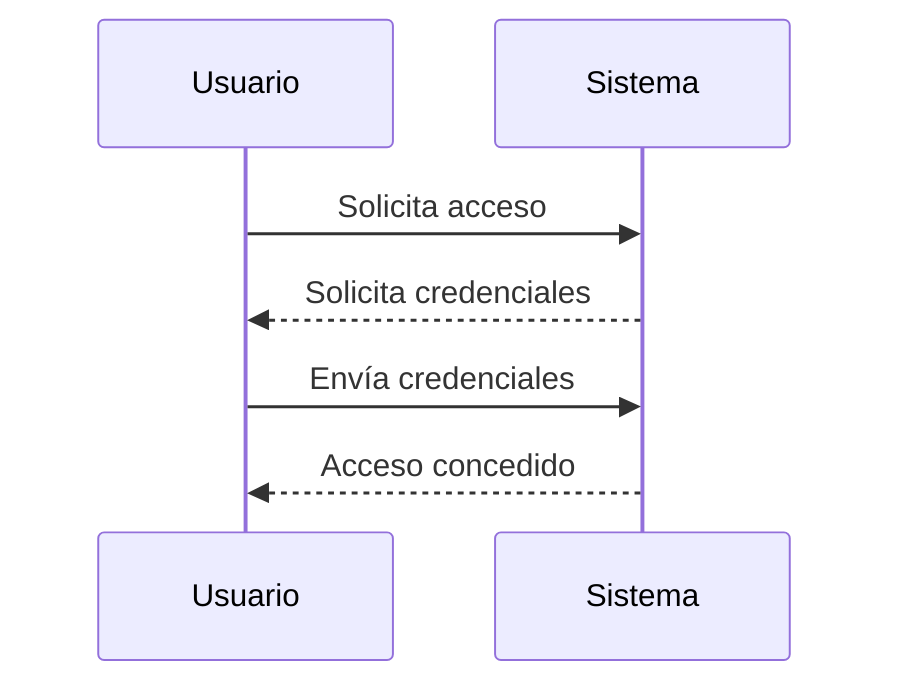
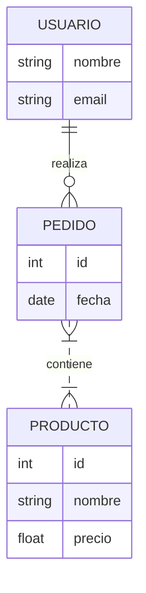
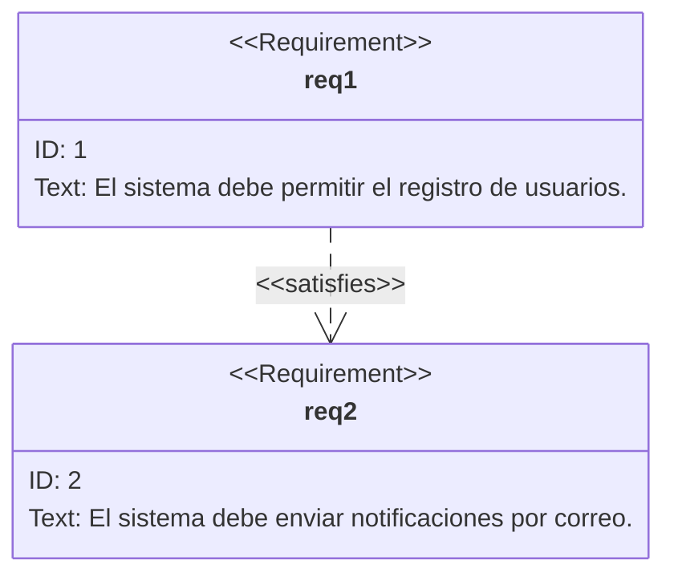

  
Este repositorio contiene páginas Markdown (MD) que incluyen diagramas UML utilizando la sintaxis de Mermaid. Aquí encontrarás ejemplos de diferentes tipos de diagramas útiles para el diseño y documentación de software.

## Ejemplos de Diagramas

### Diagrama de Casos de Uso

```mermaid
usecase
  :Usuario: --> (Iniciar sesión)
  :Usuario: --> (Consultar información)
  (Iniciar sesión) ..> (Recuperar contraseña) : <<include>>
```

### Diagrama de Secuencia



### Diagrama Entidad-Relación



### Diagrama de Requerimientos



Repositorio para realizar diseño por medio de mermaid de software.
